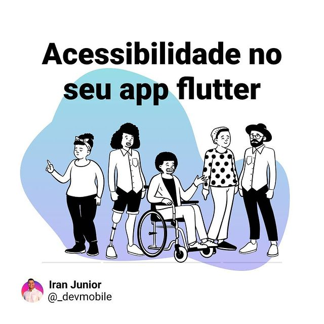

# Acessibilidade no seu app Flutter

Esse projeto tem todo o código usado no [post](https://www.instagram.com/p/CPjqBC9jV-S/) do instagram.

## Descrição

No post do instagram é mostrado ferramentas importantes que podem ser usadas em tempo de desenvolvimento para checar seu app quando um leitor de texto for tentar ler-lo, aborda também ferramentas que sugerem melhorias para tornar seu app mais acessível, e simuladores de cor para que você possa ter uma noção de como pessoas com daltonismo enxergaria seu app.

No post, e neste repositório mostro como usar widgets flutter para sobrescrever textos lidos pelo leitor de texto, ou inserir um texto, onde é apenas imagem, ou ícone. O [post](https://www.instagram.com/p/CPjqBC9jV-S/) está bem completo, e vale muito a pena ser lido.

## Sobre este repositório

Neste repositório você pode encontrar todas os códigos usados no post. Pode baixar o repositório e rodar no seu computador, para ver na prática as animações em funcionamento.

## Redes sociais

  

  

  

  